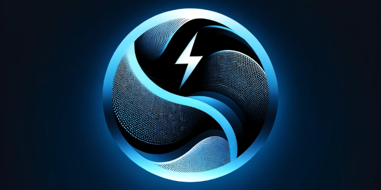

# Shindensei

The name ***"新電性" (Shindensei)*** means "New Electrical Sensuality."

**Shindensai** is an advanced electrostimulation machine development kit, inspired by the 
innovative [NeoDK](https://github.com/Onwrikbaar/NeoDK) project.

## Overview

### What is Shindensai?
Shindensai is a cutting-edge pulse-based electrostimulation device, offering a blend of simplicity and power. Its 
open-source design allows for both hardware and firmware customization, inviting creative modifications and enhancements.

### The Team
- **@Onwrikbaar** (Discord): Original Design ([NeoDK](https://github.com/Onwrikbaar/NeoDK))
- **@mike.st_** (Discord): Improvement to original NeoDK design to enables multi-channel and enhanced level control.
- **[@CalotLea](https://twitter.com/CalotLea)**: Contributing Designer (this repository)

### Disclaimer

Shindensai is an experimental and educational tool, designed for recreational use. It is provided "as-is" without any 
warranty. By using or modifying Shindensai, you agree to our [License](LICENSE.txt) terms and acknowledge all associated 
risks and liabilities. This device should be treated as a novelty and not used for critical applications.

### Usage Guidelines
 * Shindensai is to be used at your own risk.
 * Avoid using for critical applications (medical, industrial, military, or illegal purposes).
 * Ensure explicit and informed consent if used on others.
 * Limit electrode placement to below the waist.
 * Do not use triphase cables with this device.

### Safety

Shindensai can produce high voltages and currents. Despite battery operation, its use involves inherent risks. Safety 
precautions are essential, but risks cannot be completely eliminated.

### Intended Audience
Shindensai is ideal for:
 * Electronics hobbyists and professionals seeking an in-depth understanding of electrostimulation circuitry.
 * Those looking for a robust, well-tested foundation for custom e-stim projects.
 * Enthusiasts desiring high-intensity, remote-controlled e-stim experiences.
 * Users seeking unique e-stim sensations beyond conventional power boxes.
 * Innovators wanting a device that can store and play custom routines.

Embrace the forefront of electrostimulation technology with Shindensai.

## Enhanced Features Compared to NeoDK

Before diving into the enhancements, familiarize yourself with the original NeoDK design [here](https://github.com/Onwrikbaar/NeoDK/blob/main/Design.md).

### Enhancements Include:

- **Expanded Connectivity**: Integration of wireless operation capabilities, enabling control via smartphone or PC.
- **Cost-Effective Customization**: Tailor-made improvements that are budget-friendly.
- **Modularity in Output Stage**: Redesign of the output stage for better adaptability, making it more user-friendly for hobbyists and ensuring independence from the main controller.
- **Operational Indicators**: Inclusion of direct indicators on the device to display operational status.
- **Planned Future Upgrades**:
    - Integration of an internal customer-installable 18650 Li-Ion battery with USB-C charging support.
    - Development of a mobile application for enhanced control functionality.

### Design Decisions for These Enhancements:

- **Component Selection**: Preference for components primarily available through [LCSC](https://www.lcsc.com/), multiple transformer alternatives
- **PCB Design Simplicity**: Commitment to maintaining a [simple, two-layer PCB layout](https://jlcpcb.com/capabilitiesDetail?index=1).
- **Output Level Control**: Incorporation of a dedicated [high-speed DAC](https://www.microchip.com/en-us/product/mcp4726) for precise output level management.
- **Microcontroller Upgrade**: Selection of a cost-effective [RISC-V microcontroller](https://www.wch-ic.com/products/CH32V208.html) that supports expanded connectivity options (USB, BLE).
- **BLE Connectivity**: Design of a PCB-mount inverted F-antenna specifically for BLE communication.
- **Visual Feedback**: Addition of LEDs to visually indicate channel activity and BLE connection status.

## Further References
 * [Erotic Electro Stimulation](https://en.wikipedia.org/wiki/Erotic_electrostimulation)
 * NeoDK forum in Joannes E-Stim Community Discord
 * [Estim reddit](https://www.reddit.com/r/estim/)
 * SocialStim website