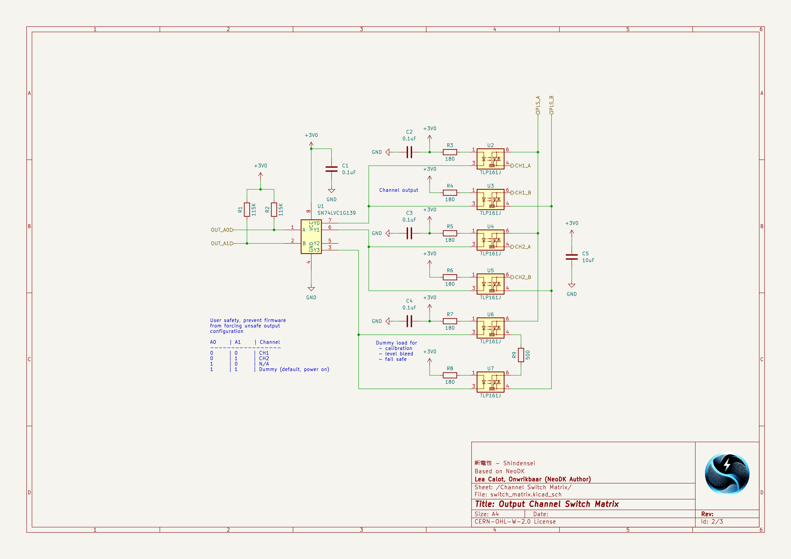

# Shindensei PCB Design

Welcome to the Shindensei Printed Circuit Board (PCB) documentation. This guide provides 
essential information for working with the Shindensei PCB design files.

## Design Tool and Version
- **KiCad Version**: The PCB design is tailored for KiCad Version 7, an open-source 
                      electronic design automation software.

## Required Plugins
To ensure optimal functionality and ease of design, the following plugins are necessary:

1. **KiCad Action Scripts**:
   - **Purpose**: Essential for via stitching, enhancing the electrical connectivity and thermal management of the PCB.
   - **Installation**: Use the KiCad Version 7 Plugin Manager

2. **FreeRouting**:
   - **Purpose**: Utilized for automated routing, helping to efficiently lay out the connections on the PCB.
   - **Installation**: Use the KiCad Version 7 Plugin Manager

## Getting Started
- **Accessing Design Files**: The PCB design files are available in the repository. Download and open them using KiCad 7.
- **Using Plugins**: After installing the required plugins, you can leverage their functionalities directly within KiCad.

## Contributing
Contributions to the Shindensei PCB design are welcome. Whether it's feature enhancement, bug fixing, or documentation, 
your input is valuable. Please follow the contribution guidelines outlined in our repository.

## Schematic Explanation

WiP

### Switch Matrix

 * Select one output pair at the time.

## Acknowledgments
A special thanks to the contributors and maintainers of [NeoDK](https://github.com/Onwrikbaar/NeoDK)
and **@mike.st_** (Discord).

---

[Return to Home](../README.md)
